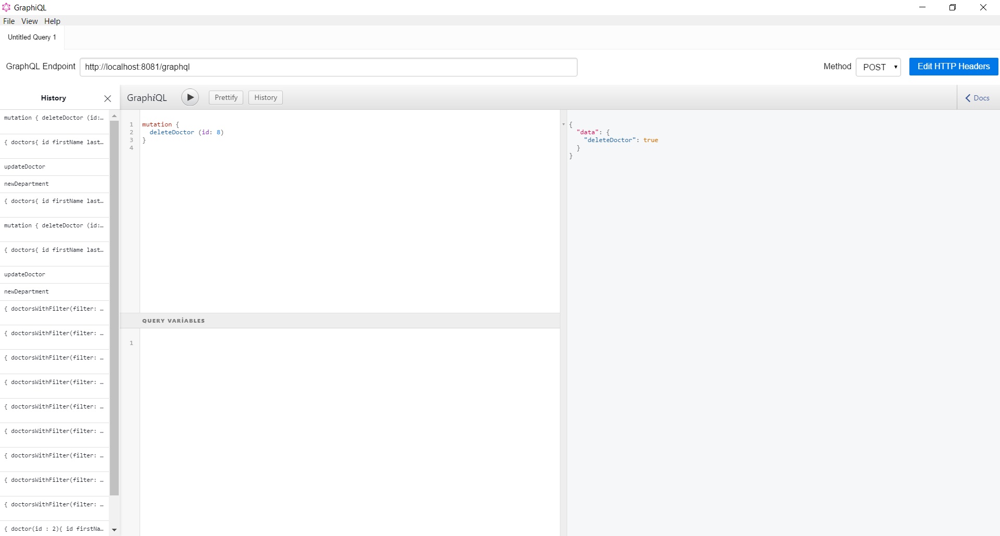

# Spring Boot and Graphql

### 📖 Information

<ul style="list-style-type:disc">
  <li>Information 1 </li>
  <li>Information 2</li>
  <li>Information 3</li>
</ul>

### 🔨 Run the App

<b>1 )</b> 

<b>2 )</b> 

<b>3 )</b> 

### Table

<table style="border: 0px;">
  <tr>
     <td align="center" colspan="1"> Entity </td>
     <td align="center" colspan="3"> Information </td>
  </tr>
  <tr>
     <td align="center" rowspan="4"> Hospital </td>
  </tr>
  <tr>
     <td align="center"> Query Information </td>
     <td align="center"> Query </td>
     <td align="center"> Query Variables </td>
  </tr>
  <tr>
      <td align="center"></td>
      <td align="center"></td>
      <td align="center"></td>
  </tr>
  <tr>
      <td align="center"></td>
      <td align="center"></td>
      <td align="center"></td>
  </tr>
  <tr>
     <td align="center" rowspan="4"> Department </td>
  </tr>
  <tr>
     <td align="center"> Query Information </td>
     <td align="center"> Query </td>
     <td align="center"> Query Variables </td>
  </tr>
  <tr>
     <td align="center"></td>
     <td align="center"></td>
     <td align="center"></td>
  </tr>
  <tr>
     <td align="center"></td>
     <td align="center"></td>
     <td align="center"></td>
  </tr>
  <tr>
     <td align="center" rowspan="4"> Doctor </td>
  </tr>
  <tr>
     <td align="center"> Query Information </td>
     <td align="center"> Query </td>
     <td align="center"> Query Variables </td>
  </tr>
  <tr>
     <td align="center"></td>
     <td align="center"></td>
     <td align="center"></td>
  </tr>
  <tr>
     <td align="center"></td>
     <td align="center"></td>
     <td align="center"></td>
  </tr>
</table>

### Screenshots

Click here to show the screenshots of project

    
 Figure 1 

    
    
 Figure 2 

    
    
 Figure 3 

    
    
 Figure 4 

    
    
 Figure 5 

    
    
 Figure 6 

    
    
 Figure 7 

    
    
 Figure 8 

    
    
 Figure 9 

    
    
 Figure 10 

    
    
 Figure 11 

    
    
 Figure 12 

    
    
 Figure 13 

    
    
 Figure 14 

    
    
 Figure 15 

    
    
 Figure 16 

    
    
 Figure 17 

    
    
 Figure 18 

    
    
 Figure 19 

    
    
 Figure 20 

    
    
 Figure 21 

    
    
 Figure 22 

    
    
 Figure 23 

    
    
 Figure 24 

    
    
 Figure 25 

    
    
 Figure 26 

    
    
 Figure 27 

    
    
 Figure 28 

    
    
 Figure 29 

    
    
 Figure 30 

    
    
 Figure 31 

    
    
 Figure 32 

    
    
 Figure 33 

    
    
 Figure 34 

    
    
 Figure 35 

            

